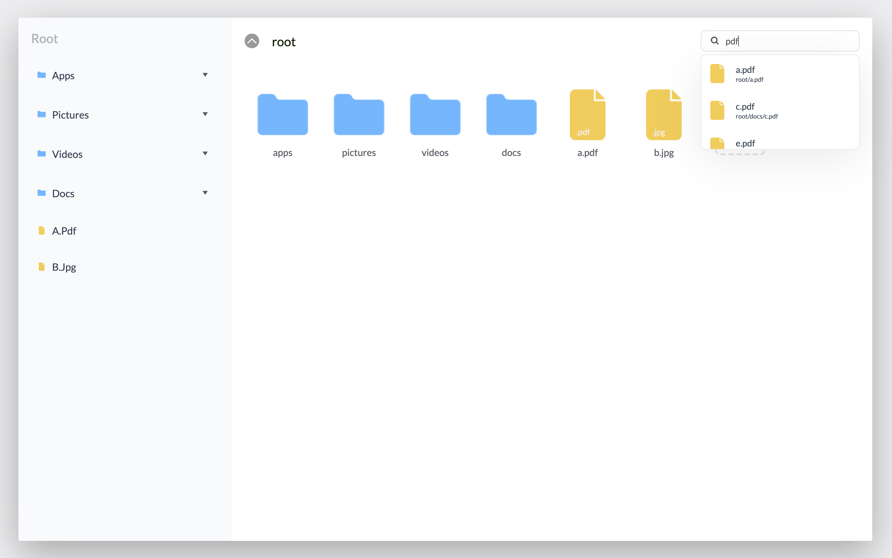
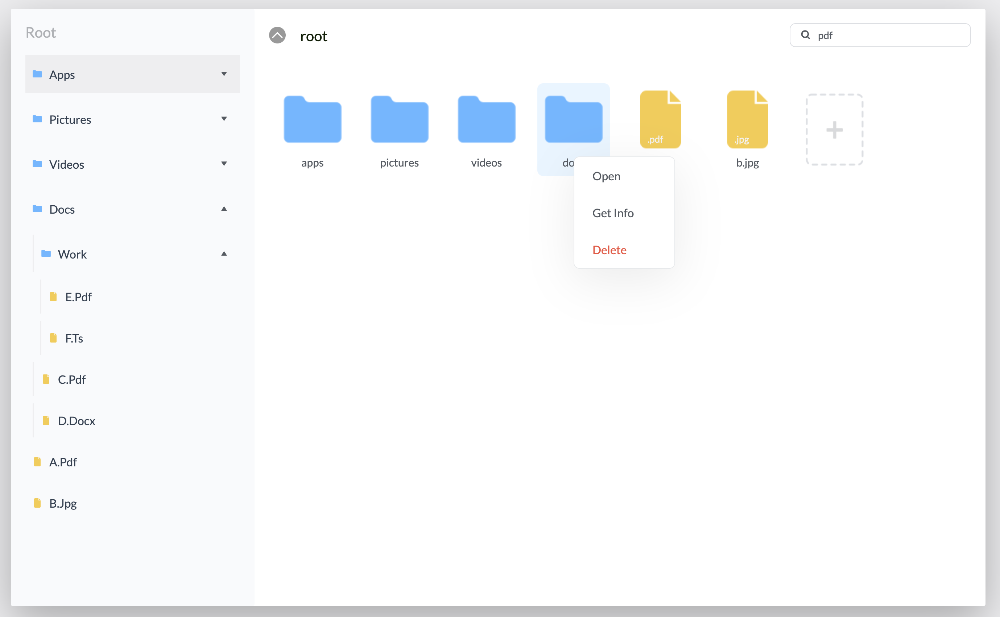

# File Explorer

This project is assignment - Simulation of files/folder exploration in finder.

#### Features

1. User can explore files/folders like they explore in file explorer/finder (This is basic version)
2. Can able to search the files/folders.
3. Tree view was implemented for easy lookup of files/folders
4. Double click or Right click on the folder to navigate
5. Delete the folder by right click and select Delete
6. File extension are visible on file thumbnail

NOTE: This project is implemented from scratch no external library used for styling/search/tree view.

#### Screenshots

1. ##### File/Folder View

   

2. ##### File/Folder Tree View

   

3. ##### File/Folder Search

   

4. ##### File/Folder Actions

   

5. ##### File/Folder Creation

   

6. ##### File/Folder Information
   

#### Steps to run

clone the project and run `npm install` after installation run `npm start` it will automatically open the browser with url `localhost:3000` the project will be visible there.
